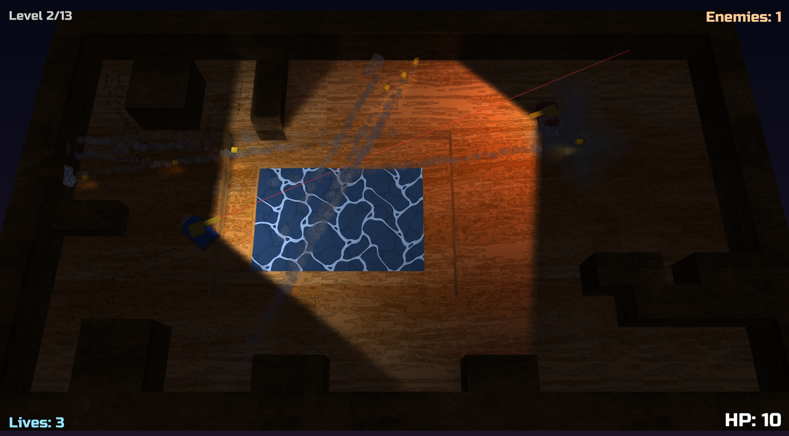

# Tank Game

<p align="center">
  
</p>

A multiplayer tank combat game built in C17 with Sokol (sokol_app + sokol_gfx) with the help of Pi and Claude Opus.

Terrible and work in progress.

## Building

### Prerequisites
- CMake 3.16+
- C17 compiler (clang or gcc)
- Git (for submodules)

### macOS
```bash
brew install cmake
git submodule update --init --recursive
```

### Build
```bash
make build    # Build the project
make run      # Build and run
make clean    # Clean build directory
make debug    # Build with debug config
make release  # Build with release config
```

### Shader generation
Sokol shaders are defined in `shaders/sokol/` and compiled with sokol-shdc.
```bash
tools/build_sokol_shaders.sh
```

## Project Structure

```
tankgame/
├── src/
│   ├── main.c          # Entry point
│   ├── core/           # Foundation utilities
│   ├── engine/         # Core engine systems
│   │   └── render/     # Renderer API + backends
│   ├── game/           # Game-specific code
│   │   └── modes/      # Game mode logic
│   ├── editor/         # In-game editor
│   └── net/            # Networking
├── shaders/            # GLSL shaders (sokol-shdc inputs in shaders/sokol/)
├── assets/             # Game assets
├── tests/              # Test suite
└── spec/               # Design documents
```

## Tools

### Map Tool
The `tools/map_tool.py` script provides CLI commands and a Python API for map manipulation:
```bash
./tools/map_tool.py --help           # Full documentation and examples
./tools/map_tool.py info <map>       # Show map info
./tools/map_tool.py validate <map>   # Validate and re-serialize
```

## Documentation

See `spec/` for design documents:
- `00-execution-plan.md` - Development milestones
- `01-game-design.md` - Game mechanics
- `02-engine-foundation.md` - Engine architecture
- `03-gameplay-tech.md` - Gameplay systems
- `04-network-protocol.md` - Networking
- `05-tooling-and-debugging.md` - Dev tools

## License

MIT
